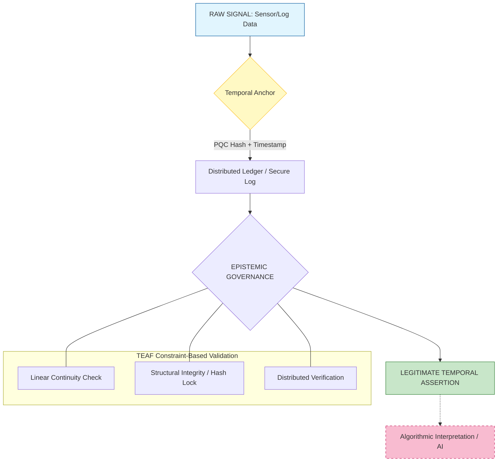

# Temporal Event Assertion Framework (TEAF)

## 🌐 Overview
TEAF is a constraint-based epistemic governance model designed to establish event legitimacy in digital and cyber-physical systems. It positions **Time** as the primary authority, separating raw signals from algorithmic interpretation to ensure data integrity in non-deterministic environments.

---

## 🛠️ Framework Logic Flow (Based on v1.1)
TEAF ensures that every digital event is "anchored" before it is interpreted. This prevents retroactive manipulation and AI-generated hallucinations by separating the **Temporal Assertion** from the **Algorithmic Interpretation**.

## Official Publication
The full whitepaper (v1.1) is officially archived on Zenodo. You can read and download the complete document here:
👉 **[Read on Zenodo](https://doi.org/10.5281/zenodo.18715558)**

## Key Applications
* **Digital Forensics:** Validating event logs in non-deterministic environments.
* **Cyber-Physical Systems:** Ensuring sensor data integrity in IoT and Drones.
* **AI Reliability:** Differentiating between classification failure and event absence.

📄 Official Publication
The full whitepaper (v1.1) is officially archived on Zenodo.

## Citation
If you use this framework, please cite it as:
> Rompis, J. M. E. (2026). *Temporal Event Assertion Framework (TEAF): A Constraint-Based Epistemic Governance Model for Digital and Cyber-Physical System*. Zenodo. https://doi.org/10.5281/zenodo.18715558

---
*Maintained by Jadwin M.E. Rompis - Independent Researcher*
